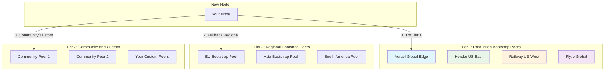
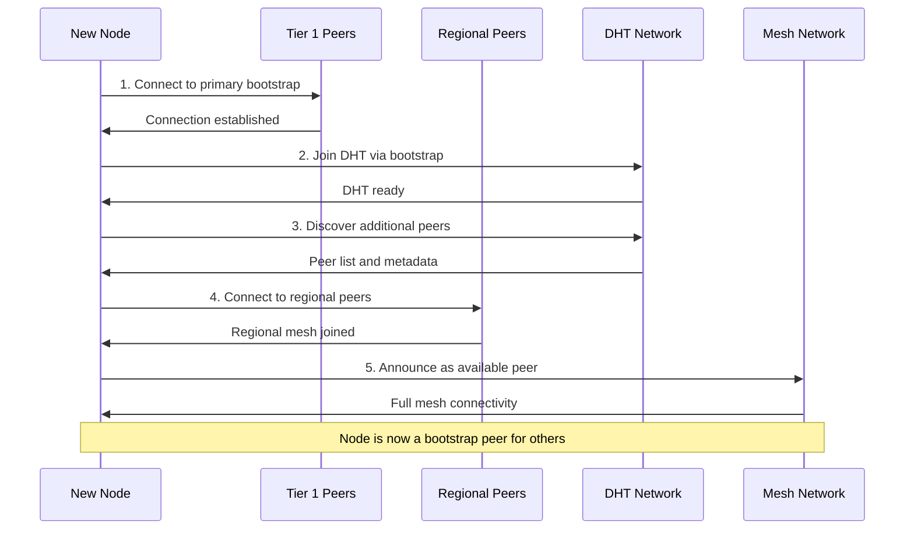
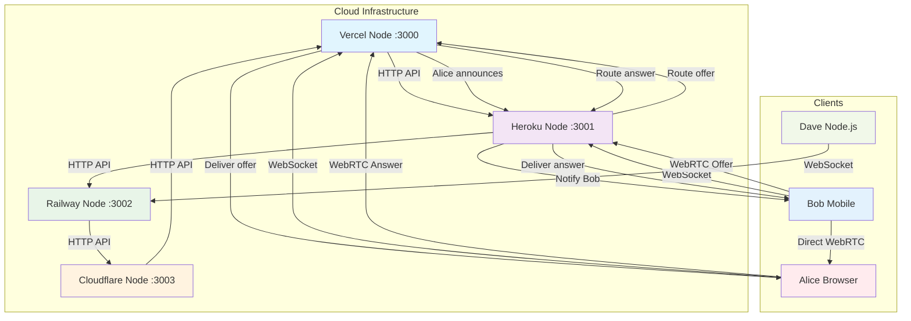
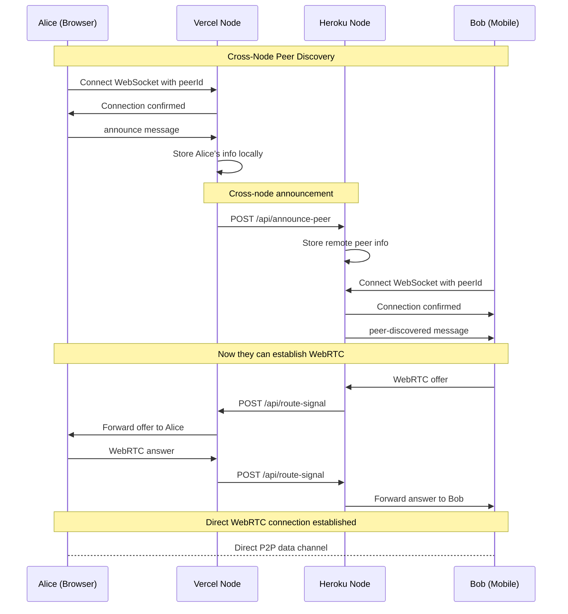
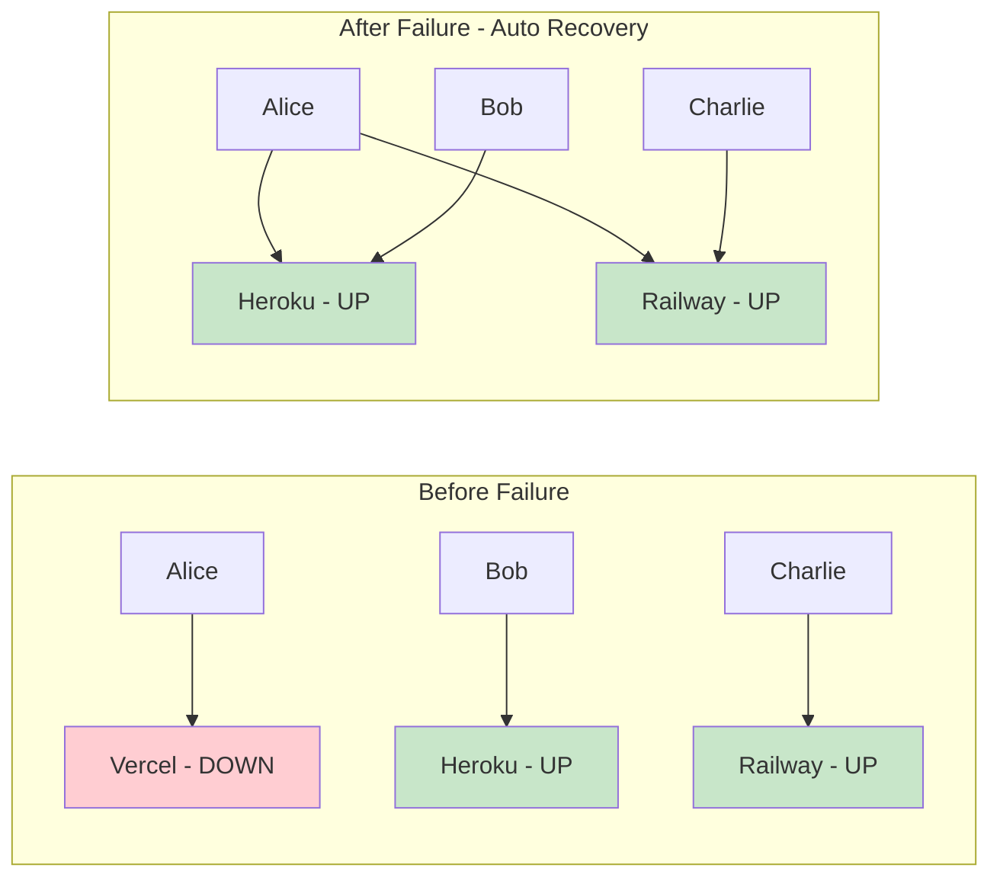
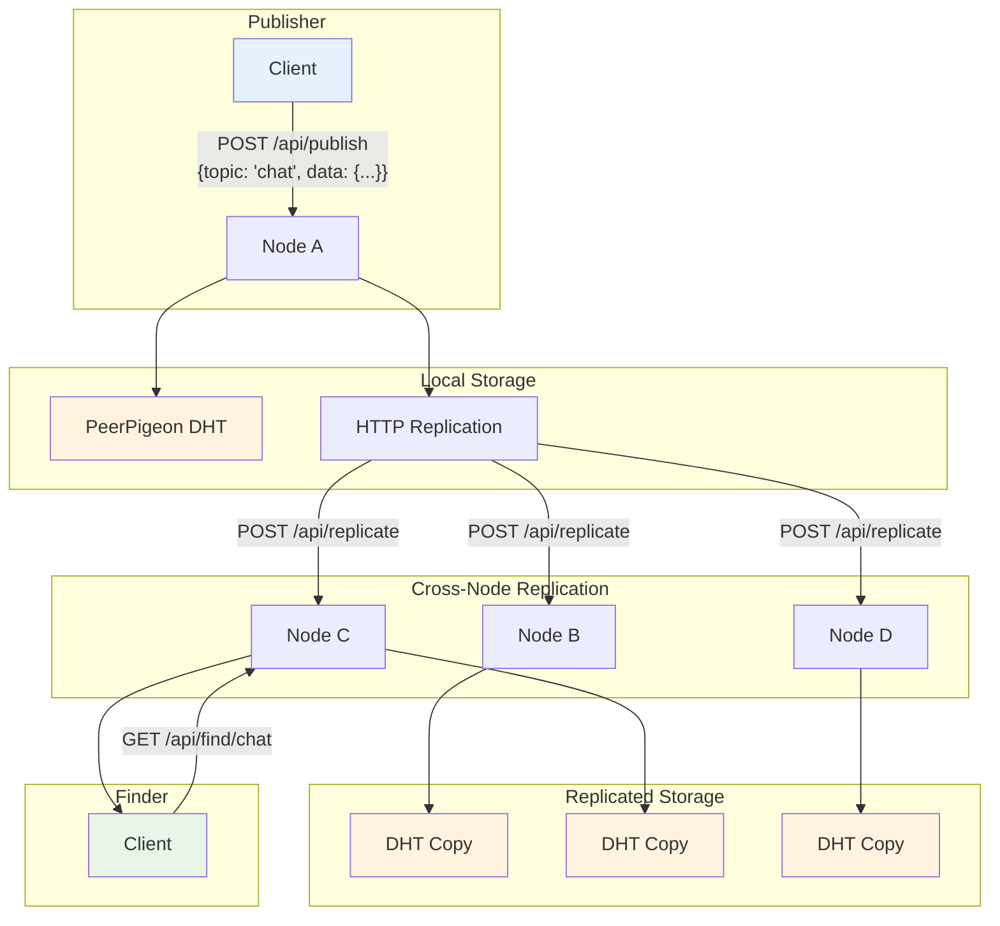
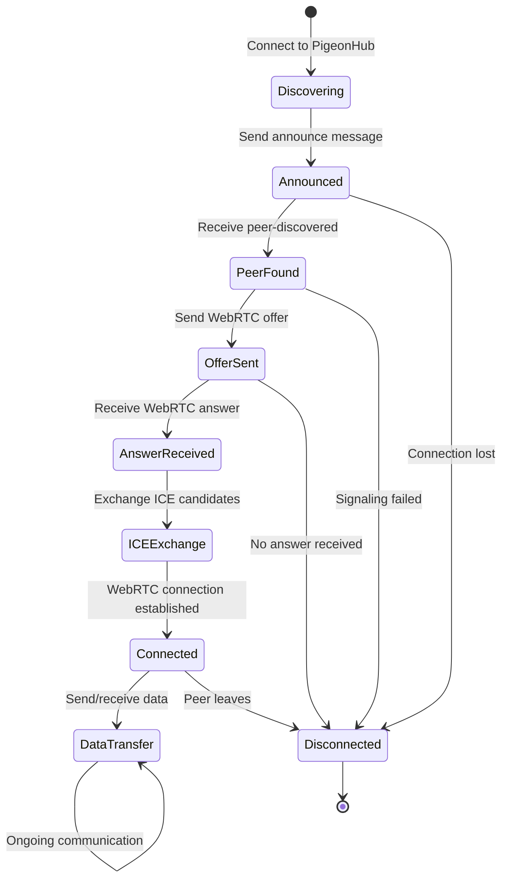
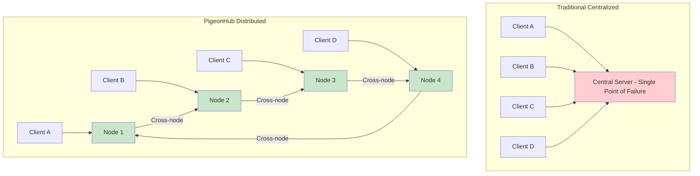

# PigeonHub

A production-ready, distributed WebRTC signaling mesh with "whack-a-mole" resilience built on PeerPigeon WebDHT.

## 🚀 Overview

PigeonHub provides a **censorship-resistant, globally distributed signaling infrastructure** for WebRTC applications. Unlike traditional centralized signaling servers, PigeonHub creates a resilient mesh of interconnected nodes that can survive individual node failures through automatic cross-node peer discovery and signal routing.

## ✨ Key Features

### 🌐 **Multi-Cloud Deployment Infrastructure**
- **One-command deployment** to Vercel, Heroku, Railway, Fly.io, and Cloudflare Workers
- **Auto-scaling** support with load balancer integration
- **Environment-aware** configuration for development and production

### 🔧 **Distributed Resilient Architecture** 
- **"Whack-a-mole" resilience**: Peers automatically discover each other across different nodes
- **Cross-node signal routing**: Offers/answers/ICE candidates route between nodes automatically
- **No single point of failure**: Any node can go down without breaking peer connections

### 📡 **Standards-Compliant WebRTC Signaling**
- **Exact PeerPigeon protocol** implementation for maximum compatibility
- **SHA1 peer ID validation** and proper connection management
- **Full WebRTC lifecycle support**: peer discovery, offer/answer exchange, ICE candidate routing

### 🖥️ **Cross-Platform Compatibility**
- **Node.js 18+** server deployment
- **Modern browsers** (Chrome 79+, Firefox 72+, Safari 14+)
- **ESM modules**: No build step required

### 📊 **Monitoring & Health Checks**
- **Health endpoints** for load balancer integration
- **Real-time connection metrics** and peer tracking
- **Comprehensive logging** for production debugging

### 🔐 **Decentralized Data Storage**
- **PeerPigeon WebDHT** integration for persistent data
- **Ed25519 signatures** ensure data authenticity
- **HTTP replication** fallback when DHT is unavailable

## 🏗️ Installation

```bash
npm install pigeonhub
```

## 🚀 Quick Start

### Local Development

Start multiple nodes locally to test the mesh:

```bash
# Terminal 1: Start first node
npm run local:node1

# Terminal 2: Start second node  
npm run local:node2

# Terminal 3: Test cross-node functionality
npm run local:test
```

### Browser Client

```html
<!DOCTYPE html>
<html>
<head>
  <title>PigeonHub WebRTC Demo</title>
</head>
<body>
  <div id="peers"></div>
  <button onclick="connectToPeer()">Connect to Peers</button>
  
  <script type="module">
    // Generate a peer ID
    const response = await fetch('http://localhost:3000/generate-peer-id');
    const { peerId } = await response.json();
    
    // Connect to signaling server
    const ws = new WebSocket(`ws://localhost:3000?peerId=${peerId}`);
    
    ws.onopen = () => {
      // Announce this peer
      ws.send(JSON.stringify({
        type: 'announce',
        data: { name: 'Browser Peer', capabilities: ['video', 'audio'] }
      }));
    };
    
    ws.onmessage = (event) => {
      const message = JSON.parse(event.data);
      console.log('Received:', message);
      
      if (message.type === 'peer-discovered') {
        document.getElementById('peers').innerHTML += 
          `<p>Found peer: ${message.data.name || 'unnamed'}</p>`;
      }
    };
  </script>
</body>
</html>
```

### Node.js Client

```javascript
import { bootstrapPeerPigeon, SignalDirectory, getBootstrapPeers } from 'pigeonhub';
import WebSocket from 'ws';

// Configure bootstrap peers for your environment
const bootstrapPeers = getBootstrapPeers({
  environment: 'production',  // or 'development', 'local'
  region: 'us-east',         // Optional: prefer regional peers
  customPeers: [             // Optional: add your own bootstrap peers
    { t: 'wss', u: 'wss://your-node.example.com' }
  ]
});

// Bootstrap the mesh with DHT capabilities
const { mesh, dht } = await bootstrapPeerPigeon({
  appId: 'your-app-mesh',
  hardcodedSeeds: bootstrapPeers,
  maxRetries: 3
});

// Connect to signaling WebSocket  
const ws = new WebSocket('ws://localhost:3000?peerId=' + generatePeerId());

ws.on('open', () => {
  // Announce this peer
  ws.send(JSON.stringify({
    type: 'announce',
    data: { 
      name: 'Node.js Peer',
      capabilities: ['file-transfer', 'messaging']
    }
  }));
});

ws.on('message', (data) => {
  const message = JSON.parse(data);
  
  if (message.type === 'peer-discovered') {
    console.log('🔍 Discovered peer:', message.data);
  } else if (message.type === 'offer') {
    console.log('📞 Received WebRTC offer from:', message.fromPeerId);
    // Handle WebRTC offer...
  }
});
```

## � Bootstrap Peers

Bootstrap peers are the backbone of PigeonHub's distributed architecture. They provide **initial connectivity** for new nodes joining the mesh and ensure **network resilience** through diverse geographic distribution.

### Multi-Tier Bootstrap Architecture



### 📋 **Default Bootstrap Peers**

PigeonHub includes **battle-tested production bootstrap peers**:

| Peer | URL | Region | Provider | Priority |
|------|-----|--------|----------|----------|
| **Vercel Global** | `wss://pigeonhub.vercel.app` | Global Edge | Vercel | 🔥 Primary |
| **Heroku US** | `wss://pigeonhub.herokuapp.com` | US East | Heroku | ⭐ Secondary |  
| **Railway US** | `wss://pigeonhub.railway.app` | US West | Railway | ⭐ Secondary |
| **Fly.io Global** | `wss://pigeonhub.fly.dev` | Global | Fly.io | ⭐ Secondary |

### ⚙️ **Configuration Options**

#### Environment Variables
```bash
# Custom bootstrap peers (comma-separated)
export BOOTSTRAP_PEERS="wss://peer1.example.com,wss://peer2.yourorg.net"

# Geographic region preference  
export REGION="us-west"  # Options: us-east, us-west, eu-west, asia-pacific

# Application mesh identifier
export APP_ID="your-unique-app-mesh"

# Public URL for bootstrap announcements
export PUBLIC_URL="wss://your-domain.com"
```

#### Programmatic Configuration
```javascript
import { getBootstrapPeers, parseBootstrapPeersFromEnv } from 'pigeonhub/config';

// Get environment-aware bootstrap peers
const peers = getBootstrapPeers({
  environment: 'production',     // 'production', 'development', 'local'
  region: 'eu-west',            // Geographic preference
  customPeers: [                // Your additional peers
    { 
      t: 'wss', 
      u: 'wss://your-peer.com',
      region: 'eu-west',
      priority: 1,
      description: 'Primary EU peer'
    }
  ],
  includeLocal: false           // Include localhost peers
});

// Parse from environment
const envPeers = parseBootstrapPeersFromEnv(process.env.BOOTSTRAP_PEERS);
```

### 🔧 **Setting Up Your Own Bootstrap Peer**

#### 1. Deploy a PigeonHub Node
```bash
# Deploy to your preferred platform
git clone https://github.com/your-org/pigeonhub
cd pigeonhub

# Configure environment
export APP_ID="your-app-mesh"
export PUBLIC_URL="wss://your-bootstrap.example.com"
export REGION="eu-west"

# Deploy 
npm run deploy
```

#### 2. Configure High Availability
```yaml
# docker-compose.yml for redundant bootstrap
version: '3.8'
services:
  bootstrap-1:
    image: pigeonhub:latest
    environment:
      - PORT=3000
      - PUBLIC_URL=wss://bootstrap1.example.com
      - REGION=eu-west
    
  bootstrap-2:  
    image: pigeonhub:latest
    environment:
      - PORT=3001
      - PUBLIC_URL=wss://bootstrap2.example.com
      - REGION=eu-west
```

#### 3. Register with Community
```javascript
// Contribute your bootstrap peer to the community
const communityPeer = {
  t: 'wss',
  u: 'wss://your-bootstrap.example.com',
  region: 'eu-west',
  priority: 3,
  description: 'Community EU bootstrap peer',
  maintainer: 'your-org',
  uptime: '99.9%'
};

// Submit via GitHub issue or pull request
```

### Bootstrap Process Flow



### 🔍 **Bootstrap Peer Discovery**

PigeonHub automatically discovers and caches bootstrap peers:

```javascript
// Automatic peer discovery sources:
// 1. DNS TXT records: _pigeonhub-bootstrap.example.com
// 2. Well-known endpoints: /.well-known/pigeonhub-bootstrap
// 3. DHT announcements: bootstrap-peer-* keys
// 4. Environment configuration: BOOTSTRAP_PEERS
// 5. Hardcoded production peers (fallback)

// Check discovered peers
const discoveredPeers = await discoverBootstrapPeers('your-app-mesh');
console.log(`Found ${discoveredPeers.length} bootstrap peers`);
```

### ⚡ **Performance & Reliability**

#### Connection Strategy
- **Parallel connections**: Try multiple bootstrap peers simultaneously
- **Priority-based selection**: Higher priority peers tried first  
- **Regional optimization**: Prefer geographically close peers
- **Automatic failover**: Switch to backup peers if primary fails
- **Health monitoring**: Remove unhealthy peers from rotation

#### Caching & Persistence
```javascript
// Bootstrap peers are cached locally for faster startup
const cacheConfig = {
  ttl: 86400,              // Cache for 24 hours
  maxPeers: 50,            // Keep top 50 peers
  healthCheckInterval: 300  // Check health every 5 minutes
};
```

### 🛡️ **Security Considerations**

#### Peer Verification
```javascript
// Bootstrap peers support Ed25519 signature verification
const verifiedPeer = {
  t: 'wss',
  u: 'wss://trusted-peer.com',
  publicKey: 'base64-ed25519-public-key',
  signature: 'base64-signature',
  timestamp: Date.now()
};
```

#### Trust Model
- **Production peers**: Maintained by PigeonHub project (high trust)
- **Community peers**: Community maintained (medium trust)  
- **Custom peers**: Your infrastructure (full trust)
- **Auto-discovered**: DHT discovered (verify before use)

## �🌍 Production Deployment

### One-Command Multi-Cloud Deployment

```bash
# Deploy to all supported platforms
npm run deploy

# Or deploy to specific platforms
vercel --prod                # Vercel
git push heroku main         # Heroku  
railway deploy              # Railway
wrangler deploy             # Cloudflare Workers
```

### Environment Variables

```bash
# Required for production
PORT=3000                    # Server port
NODE_ENV=production         # Environment
HOST=0.0.0.0               # Bind to all interfaces

# Bootstrap Peer Configuration
BOOTSTRAP_PEERS=wss://your-peer1.com,wss://your-peer2.com  # Custom bootstrap peers
APP_ID=your-app-mesh       # Unique application identifier for mesh isolation
REGION=us-east            # Geographic region for regional peer preference

# Optional
SIGNALING_TIMEOUT=5000     # WebSocket timeout
DHT_BOOTSTRAP_RETRIES=3    # DHT connection retries
CORS_ORIGIN=*              # CORS configuration
PUBLIC_URL=wss://your-domain.com  # Public URL for bootstrap announcements
```

### Bootstrap Peer Configuration

PigeonHub uses a **multi-tier bootstrap system** for maximum resilience:

#### 🏭 **Production Bootstrap Peers**
```javascript
// Automatically included in production
const productionPeers = [
  'wss://pigeonhub.vercel.app',    // Global edge network
  'wss://pigeonhub.herokuapp.com', // US East  
  'wss://pigeonhub.railway.app',   // US West
  'wss://pigeonhub.fly.dev'        // Global anycast
];
```

#### 🔧 **Custom Bootstrap Peers**
```bash
# Environment variable configuration
export BOOTSTRAP_PEERS="wss://your-peer1.com,wss://your-peer2.com,wss://peer3.example.org"

# Or programmatic configuration
import { getBootstrapPeers } from 'pigeonhub/config';

const peers = getBootstrapPeers({
  environment: 'production',
  region: 'us-west',
  customPeers: [
    { t: 'wss', u: 'wss://your-domain.com' },
    { t: 'wss', u: 'wss://backup.your-org.net' }
  ]
});
```

#### 🌍 **Regional Bootstrap Selection**
```javascript
// Prefer regional peers for better latency
const regionalPeers = getBootstrapPeers({
  region: 'eu-west',  // Prioritizes EU peers
  environment: 'production'
});

// Available regions: 'us-east', 'us-west', 'eu-west', 'asia-pacific', 'global'
```

#### 💻 **Development Bootstrap**
```bash
# Local development automatically includes
const devPeers = [
  'ws://localhost:3000',
  'ws://localhost:3001', 
  'ws://localhost:3002',
  'ws://127.0.0.1:3000'  // IPv4 fallback
];
```

### Health Check Endpoint

```bash
# Load balancer health check
curl https://your-app.vercel.app/health

# Response:
{
  "status": "healthy",
  "nodeId": "node-production-1",
  "uptime": 3600000,
  "connected": true,
  "dhtReady": true,
  "signalDirReady": true,
  "connections": 42
}
```

## 🔧 API Reference

### WebSocket Signaling API

Connect with a SHA1 peer ID:
```
ws://your-server.com?peerId=<40-character-hex-id>
```

#### Message Types

**Announce Peer:**
```javascript
{
  "type": "announce",
  "data": {
    "name": "My App",
    "capabilities": ["video", "audio", "data"],
    "version": "1.0.0"
  }
}
```

**WebRTC Offer:**
```javascript
{
  "type": "offer",
  "data": { /* RTCSessionDescription */ },
  "targetPeerId": "abc123...",
  "fromPeerId": "def456..."
}
```

**WebRTC Answer:**
```javascript
{
  "type": "answer", 
  "data": { /* RTCSessionDescription */ },
  "targetPeerId": "def456...",
  "fromPeerId": "abc123..."
}
```

**ICE Candidate:**
```javascript
{
  "type": "ice-candidate",
  "data": { /* RTCIceCandidate */ },
  "targetPeerId": "def456...",
  "fromPeerId": "abc123..."
}
```

### HTTP REST API

#### Get Signaling Status
```bash
GET /signaling
```

#### Generate Peer ID
```bash
GET /generate-peer-id
```

#### Publish Data
```bash
POST /api/publish
Content-Type: application/json

{
  "topic": "my-topic",
  "data": { "message": "Hello World" },
  "ttl": 300
}
```

#### Find Data
```bash
GET /api/find/my-topic
```

#### Get Connected Peers
```bash
GET /peers
```

## 🧪 Testing

### Automated Tests

```bash
# Run all tests
npm test

# Test local mesh connectivity
npm run local:test

# Test WebRTC signaling
node test-webrtc-client.mjs
```

### Manual Testing Scenarios

1. **Cross-Node Peer Discovery:**
   ```bash
   # Start two nodes
   npm run local:node1 &
   npm run local:node2 &
   
   # Connect peers to different nodes - they should discover each other
   ```

2. **WebRTC Signaling:**
   ```bash
   # Test offer/answer routing between nodes
   node examples/webrtc-test.mjs
   ```

3. **DHT Replication:**
   ```bash
   # Publish data and verify it replicates
   curl -X POST http://localhost:3000/api/publish \
     -H "Content-Type: application/json" \
     -d '{"topic":"test","data":{"msg":"hello"}}'
   
   curl http://localhost:3001/api/find/test
   ```

4. **Node Failure Recovery:**
   ```bash
   # Kill one node, verify peers still connect through others
   pkill -f "local-node.mjs 3000"
   # Peers should continue working via other nodes
   ```

### Load Testing

```bash
# Start monitoring
npm run monitor

# Run auto-scaling test
npm run auto-scale
```

## 🏗️ Architecture

### Distributed Signaling Mesh Overview



### Peer Discovery Flow



### Node Failure Recovery ("Whack-a-Mole")



### Data Storage & Replication



### WebRTC Connection Lifecycle



### Traditional vs PigeonHub Architecture



### Distributed Signaling Mesh

```
┌─────────────┐    ┌─────────────┐    ┌─────────────┐
│   Node A    │◄──►│   Node B    │◄──►│   Node C    │
│ :3000       │    │ :3001       │    │ :3002       │
└─────────────┘    └─────────────┘    └─────────────┘
       ▲                   ▲                   ▲
       │                   │                   │
   ┌───────┐          ┌───────┐          ┌───────┐
   │Peer 1 │          │Peer 2 │          │Peer 3 │
   └───────┘          └───────┘          └───────┘
```

### Cross-Node Communication

1. **Peer Discovery**: When a peer connects to any node, it's announced to all other nodes
2. **Signal Routing**: WebRTC offers/answers route between nodes via HTTP API
3. **DHT Replication**: Data stored on one node replicates to others
4. **Health Monitoring**: Nodes monitor each other and route around failures

### Data Flow

```
Peer A (Node 1) → Offer → Node 1 → HTTP → Node 2 → WebSocket → Peer B (Node 2)
                                     ↓
Peer B (Node 2) → Answer → Node 2 → HTTP → Node 1 → WebSocket → Peer A (Node 1)
```

## 📦 npm Scripts

```bash
# Development
npm run local:node1         # Start node on port 3000
npm run local:node2         # Start node on port 3001  
npm run local:node3         # Start node on port 3002
npm run local:node4         # Start node on port 3003

# Testing  
npm run local:test          # Test local mesh
npm test                    # Run all tests

# Production
npm run deploy              # Deploy to all platforms
npm run monitor             # Monitor deployed instances
npm run auto-scale          # Auto-scaling test

# Examples
npm run example-publish     # Publish data example
npm run example-find        # Find data example
npm run serve              # Static file server for browser tests
```

## 🔧 Platform-Specific Notes

### Vercel
- Automatically deploys on git push
- Serverless functions handle WebSocket upgrades
- Global edge network distribution

### Heroku
- Dyno-based scaling
- Built-in load balancing
- Easy environment variable management

### Railway
- Git-based deployment
- Built-in monitoring
- Database add-ons available

### Cloudflare Workers
- Edge computing deployment
- Durable Objects for state
- Global anycast network

## 🚧 Roadmap

- [ ] **Authentication**: Optional peer authentication and access control
- [ ] **Rate Limiting**: Protection against spam and abuse
- [ ] **Metrics**: Prometheus/StatsD integration
- [ ] **BitTorrent Integration**: Hybrid tracker functionality
- [ ] **Browser Extension**: Easy peer discovery for web apps
- [ ] **Mobile SDKs**: React Native and Flutter support

## 🤝 Contributing

1. Fork the repository
2. Create a feature branch: `git checkout -b feature/amazing-feature`
3. Commit changes: `git commit -m 'Add amazing feature'`
4. Push to branch: `git push origin feature/amazing-feature`
5. Open a Pull Request

## 📄 License

MIT License - see [LICENSE](LICENSE) for details.

## 🙏 Acknowledgments

- **PeerPigeon** team for the WebDHT infrastructure
- **WebRTC** community for signaling standards
- **Open source** contributors and testers

---

**Ready for production deployment** 🚀 **Scale globally** 🌍 **Never go down** 💪

